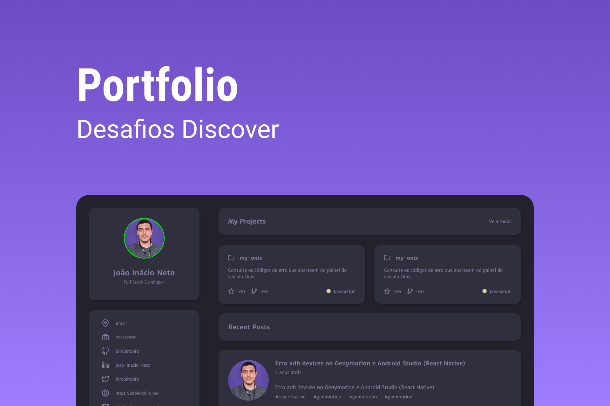

<h1 align="center"> Profile </h1>

Esse desafio foi feito através o programa DISCOVER da Rockeatseat.  

  <a href="#-tecnologias">Tecnologias</a>&nbsp;&nbsp;&nbsp;|&nbsp;&nbsp;&nbsp;
  <a href="#-projeto">Projeto</a>&nbsp;&nbsp;&nbsp;|&nbsp;&nbsp;&nbsp;
  <a href="#-layout">Layout</a>&nbsp;&nbsp;&nbsp;|&nbsp;&nbsp;&nbsp;
  <a href="#memo-licença">Licença</a>

  

 

  

## 🚀 Tecnologias

Esse projeto foi desenvolvido com as seguintes tecnologias:

- HTML e CSS
- Figma

## 💻 Projeto

O projeto PROFILE foi feito com objetivo de criar uma landing page com os dados do perfil de uma pessoa.

- [Visite o projeto online](https://msaragoca.github.io/discover-profile)

## 🔖 Layout

Você pode visualizar o layout do projeto através [DESSE LINK](<https://www.figma.com/file/KkTydUxwoR4Ih1oyGk4Mdb/DD-%2F-Portfolio-(Copy)?node-id=1323%3A2&t=7FusUj782DK6iBGL-1>). É necessário ter conta no [Figma](https://figma.com) para acessá-lo.

## :memo: Licença

Esse projeto está sob a licença MIT.

---

Feito com ♥ by Rocketseat :wave: [Participe da nossa comunidade!](https://discord.gg/rocketseat)
